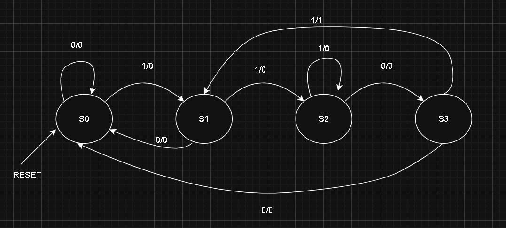

# Problem 1 — Mealy Sequence Detector (Pattern 1101, Overlapping)

## State Diagram


**State Descriptions:**
**S0** – No bits matched yet  
**S1** – Matched `1`  
**S2** – Matched `11`  
**S3** – Matched `110`  
From **S3**, if `x=1` → output `y=1` for one clock cycle and move to **S1** (overlap allowed).  


## Design Specifications
**FSM Type**: Mealy (output depends on current state and input).
**Pattern**: `1101` (overlapping allowed).
**Reset**: Active-high, synchronous.
**Output Signal**:  
`y` pulses high for one clock cycle when pattern is detected.


## Repository Structure
problem1\_seqdet/
│
├── seq\_detect\_mealy.v       # FSM RTL design
├── tb\_seq\_detect\_mealy.v    # Testbench
├── README.md                # Documentation for this problem
└── waves/
├── state\_diagram.png    # FSM diagram image
└── waveform.png         # GTKWave waveform screenshot

## How to Compile and Run (Icarus Verilog + GTKWave)
Open a terminal in `problem1_seqdet/` and run:
iverilog -o sim.out tb_seq_detect_mealy.v seq_detect_mealy.v
vvp sim.out
gtkwave dump.vcd

* Step 1: `iverilog` compiles the design and testbench.
* Step 2: `vvp` runs the compiled simulation and generates `dump.vcd`.
* Step 3: `gtkwave` opens the waveform file for viewing.

## Testbench Details

The testbench:

* Generates a 10 ns period clock.
* Applies reset for the first few cycles.
* Drives the input stream:

  ```
  1 1 0 1 1 0 1 1 1 0 1
  ```
* Dumps simulation data to `dump.vcd`.

## Expected Output Behavior

For the input stream `11011011101`:

* Pattern `1101` is detected at these ending bit positions (1-based indexing):

  * **Position 4** → Output `y=1`
  * **Position 7** → Output `y=1`
  * **Position 11** → Output `y=1`

**Expected Output Table:**

| Clock Cycle | Input x | dbg\_state | Output y |
| ----------- | ------- | ---------- | -------- |
| 1           | 1       | S1         | 0        |
| 2           | 1       | S2         | 0        |
| 3           | 0       | S3         | 0        |
| 4           | 1       | S1         | 1        |
| 5           | 1       | S2         | 0        |
| 6           | 0       | S3         | 0        |
| 7           | 1       | S1         | 1        |
| 8           | 1       | S2         | 0        |
| 9           | 1       | S2         | 0        |
| 10          | 0       | S3         | 0        |
| 11          | 1       | S1         | 1        |

---

## Simulation Waveform

The waveform below shows:

* **clk** — clock signal.
* **reset** — active-high reset at start.
* **x** — input data stream.
* **y** — one-cycle pulses when pattern `1101` is detected.
* **dbg\_state** — FSM state transitions.


