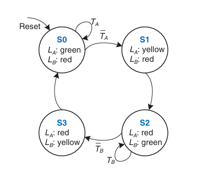
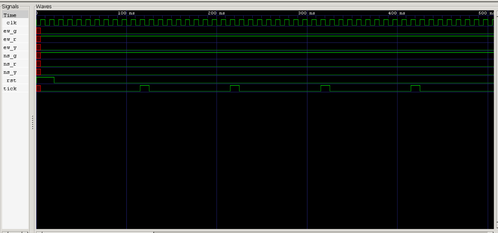

# Problem 2 — Moore Traffic Light Controller

## State Diagram

**State Descriptions:**
**NS_G**: North-South = Green (01), East-West = Red (00), duration = 5 ticks  
**NS_Y**: North-South = Yellow (10), East-West = Red (00), duration = 2 ticks  
**EW_G**: North-South = Red (00), East-West = Green (01), duration = 5 ticks  
**EW_Y**: North-South = Red (00), East-West = Yellow (10), duration = 2 ticks  

## Design Specifications
**FSM Type**: Moore  
**Reset**: Active-high, synchronous  
**Timing**: Controlled by a separate `tick_generator` module  
**Outputs**:  
  `NS` → 2-bit encoding of NS lights (00=Red, 01=Green, 10=Yellow)  
  `EW` → 2-bit encoding of EW lights (00=Red, 01=Green, 10=Yellow)  
**Operation**:  
  FSM transitions only occur on **tick pulses** (not every clock cycle).  
  Each state has a fixed duration (5 or 2 ticks) before moving to the next.  

## Repository Structure

problem2\_traffic/
│
├── tick\_generator.v        # Generates 1 Hz tick (scaled in simulation)
├── traffic\_light.v         # Moore FSM for traffic lights
├── tb\_traffic\_light.v      # Testbench
├── README.md               # Documentation
└── waves/
├── state\_diagram.png   # FSM state diagram
└── waveform.png        # GTKWave screenshot

## How to Compile and Run (Icarus Verilog + GTKWave)
From inside the `problem2_traffic/` folder:

# Compile
iverilog -o sim.out tb_traffic_light.v tick_generator.v traffic_light.v

# Run simulation
vvp sim.out

# Open waveform
gtkwave dump.vcd

## Testbench Details

* Clock period = 10 ns (`#5 clk = ~clk;`)
* Tick generator parameter `COUNT_MAX` set to **20** for simulation (1 tick every 20 clock cycles).
* Simulation runs long enough to cover at least 2 full traffic light cycles.
* Dumps signals into `dump.vcd` for GTKWave.

## Expected Behavior

Traffic lights must follow the sequence:

| State  | Duration (ticks) | NS Light | EW Light |
| ------ | ---------------- | -------- | -------- |
| NS\_G  | 5                | Green    | Red      |
| NS\_Y  | 2                | Yellow   | Red      |
| EW\_G  | 5                | Red      | Green    |
| EW\_Y  | 2                | Red      | Yellow   |
| Repeat |                  |          |          |

## Simulation Waveform

The GTKWave screenshot below shows `clk`, `reset`, `tick`, `NS`, and `EW`.
The FSM cycles correctly with **5 ticks green/yellow, 2 ticks red/yellow** transitions.

---

## Tick Generation and Verification
- A separate `tick_generator.v` module was used to derive a 1 Hz tick from the fast system clock.
- For simulation purposes, the parameter `COUNT_MAX` was scaled down to **20** so that one tick is generated every 20 clock cycles (instead of real hardware seconds).
- The **tick signal** is a **single-cycle pulse** which drives the FSM state transitions.
- Verification:
  - In GTKWave, the `tick` waveform was added along with `clk`, `NS`, and `EW`.
  - It was confirmed that `tick` goes high only once every 20 cycles of `clk`.
  - State transitions (NS_G → NS_Y → EW_G → EW_Y) occur **only when `tick=1`**, never in between clock cycles.

