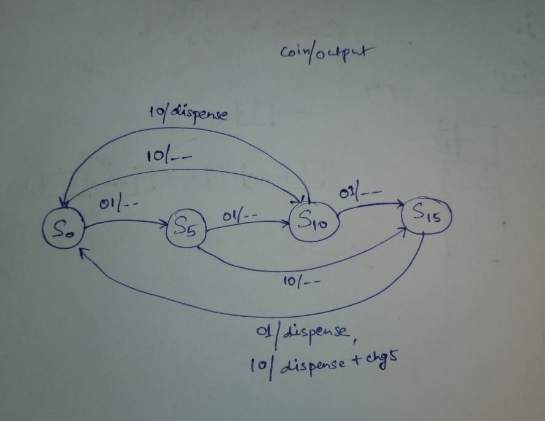

# Problem 3 – Vending Machine (Mealy FSM)

## Problem Statement
Design a **vending machine** using a **Mealy Finite State Machine (FSM)**.  
Item price = 20  
Accepted coins = 5 and 10  
The machine dispenses the product when the total reaches 20.  
If the user inserts 25 (15 + 10), the machine must **dispense + return 5** as change.  
Design should use synchronous FSM coding style (state register on `posedge clk`) and outputs as **wires**.

## FSM Design

### States
**S5**: 5 balance  
**S10**: 10 balance  
**S0**: 0 balance  
**S15**: 15 balance  

### Transitions
From `S0`:  
  coin=5 → S5  
  coin=10 → S10  

From `S5`:  
  coin=5 → S10  
  coin=10 → S15  

From `S10`:  
  coin=5 → S15  
  coin=10 → **dispense, go to S0**  

From `S15`:  
  coin=5 → **dispense, go to S0**  
  coin=10 → **dispense + chg5, go to S0**  

## State Diagram

Edges are labeled as `coin / outputs`.  
Example: `S15 -- coin=10 --> S0 [dispense=1, chg5=1]`.

## RTL Files
`vending_mealy.v` → RTL design (FSM implementation)  
`tb_vending_mealy.v` → Testbench (applies sequences of coins)  

## How to Run (Icarus Verilog + GTKWave)

iverilog -o sim.out tb_vending_mealy.v vending_mealy.v
vvp sim.out
gtkwave dump.vcd

